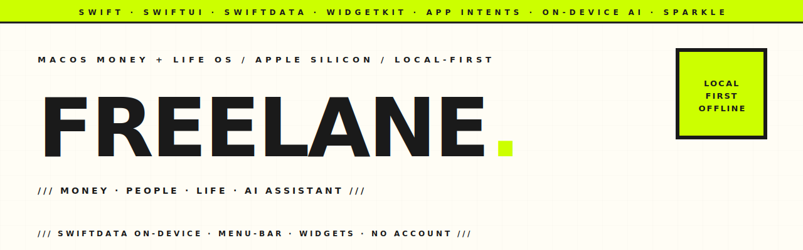

<p align="center">
  <picture>
    <source media="(prefers-color-scheme: dark)" srcset="assets-readme/hero-banner-dark.svg" />
    
  </picture>
</p>

<p align="center">
  
  
  
  
  
  
</p>

<p align="center">
  <em>A native macOS money + life operating system for Apple Silicon — <strong>not</strong> a web wrapper. Local-first and on-device-AI-first: the full money core (payments, wallets, projects, spending, loans, stats), People (clients, entities, vendors), a Life layer (journal, faith, body, sadaka, Quran), and a grounded AI assistant + curiosity engine — all on a SwiftData store on your Mac. Works offline, no account. Cloud AI only if you turn it on.</em>
</p>

---

### `/// WHAT IT IS`

```
┌───────────────┬──────────────────────────────┬──────────────────────────┐
│ SIDEBAR        │ MONEY                        │ INTELLIGENCE             │
│ ▸ Today        │ ▸ Payments (chain + fees)    │ ▸ Grounded AI chat       │
│ ▸ Dashboard    │ ▸ Wallets / withdrawals      │ ▸ Curiosity engine       │
│ ▸ Money        │ ▸ Projects · Spending        │ ▸ Insights · notifications│
│ ▸ People       │ ▸ Loans · Stats · Activity   │                          │
│ ▸ Life         ├──────────────────────────────┴──────────────────────────┤
│ ▸ Intelligence │ LIFE  journal · prayer + qibla + Quran · body · sadaka   │
├───────────────┴─────────────────────────────────────────────────────────┤
│ Menu-bar glance · ⌘K command palette · ⌘F search · WidgetKit · Shortcuts │
└──────────────────────────────────────────────────────────────────────────┘
```

---

### `/// WHY IT EXISTS`

Freelane started as a freelance money tracker and grew into a single-person LifeOS. The money spine is real accounting — payments are chains of hops with per-hop fees, wallets reconcile against a single ledger, holding wallets and withdrawals are modelled deliberately — and around it sit spending, loans, faith, body, and an AI layer that actually reads your data. It runs natively, offline, and keeps your finances on your own Mac.

---

### `/// HIGHLIGHTS`

```
MONEY        Payments as fee-aware chains, wallet balances from one ledger,
             holding-wallet + withdrawal accounting, projects, year-in-review.

SPENDING     Per-spend vendors with price memory, categories, safe-to-spend,
             receipt OCR, heatmaps — the wallet you pick is the wallet that pays.

LOANS        Bidirectional, partial returns, forgive→sadaka. One card per
             person with the full lend/repay history behind it.

LIFE         Journal/letters, prayer times + qibla + Quran, body check-ins,
             and a zakat-anchored sadaka pool with its own ledger.

AI           On-device first (local Ollama → Apple FoundationModels), cloud
             Gemini only if you opt in. Grounded chat, short insights, a
             curiosity engine that learns and stops re-asking.

NATIVE       Liquid Glass throughout, MenuBarExtra, ⌘K / ⌘F palettes,
             WidgetKit widgets, App Intents / Shortcuts. SwiftData on-device.
```

---

### `/// INSTALL`

```
1.  Download Freelane.dmg from the latest release ↓
2.  Open it and drag Freelane into Applications
3.  First launch:  right-click Freelane → Open   (or System Settings →
    Privacy & Security → "Open Anyway")
```

> [!NOTE]
> Freelane is **ad-hoc signed, not notarized** (no paid Apple Developer account, like most open-source Mac apps). macOS asks you to confirm once on first launch — after that it opens normally.

**[⬇ Download the latest release](https://github.com/hatimhtm/freelane/releases/latest)**

---

### `/// UPDATES`

Updates are **manual and in-app**. When a new version is published here, Freelane surfaces it under **Settings → About** — click **Install Update…** (or **Freelane ▸ Check for Updates…** in the menu bar) for a one-click download → install → relaunch, with the changelog shown. Nothing downloads in the background; you're always in control. Your data lives in `~/Library/Application Support/Freelane/`, so updates never touch it.

---

### `/// BUILD FROM SOURCE`

```bash
git clone https://github.com/hatimhtm/freelane.git
cd freelane
open Freelane.xcodeproj     # select the Freelane scheme → Run  (Xcode 26)
```

Requires **macOS 26 (Tahoe)** and full **Xcode 26**. `xcode-select` may point at the Command Line Tools, so for command-line builds pass `DEVELOPER_DIR` (see [BUILD.md](BUILD.md)). The project uses an Xcode 16+ synchronized folder group — any `.swift` added under `Freelane/` compiles automatically.

To cut a release: bump `MARKETING_VERSION` + `CURRENT_PROJECT_VERSION` in the Xcode project, add a section to [CHANGELOG.md](CHANGELOG.md), run `scripts/release.sh`, then publish with the `gh release create` line it prints (tag `vX.Y.Z`).

---

### `/// PRIVACY`

Local-first. No account, no analytics. The only network calls are: checking this GitHub repo for updates when you ask, optional Supabase sync if you enable it, and cloud AI (Gemini) only if you turn it on — with health/intimate terms scrubbed before anything leaves the device. Your data lives in `~/Library/Application Support/Freelane/`.


---

<p align="center">
  <a href="https://hatimelhassak.is-a.dev"></a>
  <a href="https://cal.com/hatimelhassak/engineering-discovery"></a>
  <a href="https://www.linkedin.com/in/hatim-elhassak/"></a>
  <a href="mailto:hatimelhassak.official@gmail.com"></a>
</p>

<p align="center">
  <code>///&nbsp;&nbsp;OPEN FOR NEW WORK&nbsp;&nbsp;///&nbsp;&nbsp;CONTRACT &amp; FREELANCE&nbsp;&nbsp;///&nbsp;&nbsp;REMOTE WORLDWIDE&nbsp;&nbsp;///</code>
</p>
