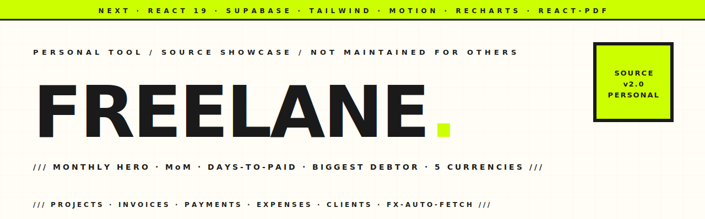

<p align="center">
  <picture>
    <source media="(prefers-color-scheme: dark)" srcset="assets/hero-banner-dark.svg" />
    
  </picture>
</p>

<p align="center">
  
  
  
  
  
  
</p>

<p align="center">
  <em><strong>My personal freelance money tracker.</strong> Built for getting paid from abroad: it tracks the <strong>net pesos that actually land</strong> after every transfer fee and FX cut, learns which payout route costs me least, and keeps a living memory of every client — with Gemini 3 Pro wired across the surface. Single-user, private, paper-and-ink editorial UI. Not a product — a tool I open every morning.</em>
</p>

---

### `/// THE IDEA`

I invoice clients abroad (CNY, USD, EUR…) and settle into pesos. The number that matters isn't what I billed — it's what **landed** in my wallet after Wise/Payoneer/banks/crypto took their cut. Freelane is built around that:

- **Unpaid money floats** with the market — an open balance is valued at today's FX rate, because that's what I'm still owed.
- **The moment I get paid, the peso amount is locked forever.** I record the exact chain it took to reach me (e.g. bank → crypto exchange → GCash), and the fee falls out of the math automatically. Future FX swings never touch a settled payment.
- **Every payment is a chain.** One hop or five — each step's fee is captured, so Freelane can tell me which *route* is actually cheapest over time.

---

### `/// WHAT'S IN THE BOX`

```
┌──────────────────────────────────────────────────────────────────┐
│ Today (the ritual screen)                                        │
│ └ One number, one situational line, one action. ⌘K to jump.      │
├──────────────────────────────────────────────────────────────────┤
│ Dashboard (monthly-first)                                        │
│ ├ Landed this month — Mercury-style masthead + MoM / WoW         │
│ ├ Outstanding (floats with FX) · fees this month · avg days·     │
│ ├ Ask your money — Gemini Q&A + on-demand insights               │
│ ├ Revenue (6-mo, draws in on scroll) · top clients               │
│ ├ Blocked money — open balances ranked by amount × days waiting  │
│ └ Cheapest ways to get paid — per-chain effective-fee leaderboard│
├──────────────────────────────────────────────────────────────────┤
│ Payments                       │ Projects                        │
│ ├ Chain entry (always-chain,   │ ├ Rich list, ranked by urgency  │
│ │   1 row by default)          │ ├ Flag a project overdue (manual)│
│ ├ Per-payment fee % chips      │ ├ Board view (kanban) on toggle │
│ ├ Method leaderboard           │ └ Unpaid / Partial / Paid       │
│ └ Expandable chain breakdown   │                                 │
├──────────────────────────────────────────────────────────────────┤
│ Clients                        │ Settings                        │
│ ├ Per-client landed/outstanding│ ├ Payment methods (+ monthly fee)│
│ ├ Living memory (Gemini folds  │ ├ Currencies & FX (auto-refresh)│
│ │   your notes into a doc)     │ ├ Add/delete any currency       │
│ └ Draft a nudge (tone-matched) │ └ Theme + sound/haptics         │
└──────────────────────────────────────────────────────────────────┘
```

---

### `/// THE AI (Gemini 3 Pro, server-side only)`

- **Ask your money** — natural-language Q&A grounded in a full snapshot of the ledger ("who's slowest to pay me?", "which route is cheapest for CNY?").
- **Insights** — 1–3 concrete, numbers-cited picks: cheaper payout route, fee anomalies, who to chase, a cashflow read. JSON-schema-locked, no fluff.
- **Living client memory** — drop a sentence about a client; Gemini folds it into a consolidated doc (summary · facts · watch flags) that informs everything else. Non-blocking — the note saves instantly.
- **Draft a nudge** — a follow-up message for an unpaid balance, tone-matched to that client's memory (casual with a long-time boss, formal with someone new).

The key never ships to the browser. All Gemini calls are server actions reading `process.env.GEMINI_API_KEY`.

---

### `/// STACK`

```
Next.js 16  · React 19  · TypeScript  · Turbopack
Tailwind 4  · motion    · @number-flow/react · recharts
Supabase (Postgres + Auth + RLS) · @supabase/ssr
@dnd-kit    · @google/genai (Gemini 3 Pro) · cmdk · sonner
```

**Design:** warm paper (`#FAF8F3`) over stark white, ink `#1A1814`, one editorial serif (Fraunces) reserved for hero numbers, a single acid-lime accent per screen, terracotta for overdue. Charts draw in on scroll; a soft tick + haptic when a payment lands. Hosted on Vercel, single-user via a password gate against a hidden Supabase user.

---

### `/// PROJECT LAYOUT`

```
src/
├── app/
│   ├── (auth)/login/                     password gate (single-user)
│   └── (app)/
│       ├── today/                        the ritual screen (root →)
│       ├── dashboard/                    monthly hero + AI + charts
│       ├── projects/                     blocked-money list + board
│       ├── payments/                     chain entry + fee leaderboard
│       ├── clients/[id]/                 detail + living memory
│       ├── activity/  settings/  year/   log · methods/FX · recap
├── components/{stats,app,motion,ui,brand}
├── lib/
│   ├── data/{queries,actions,events}.ts  server data layer
│   ├── ai/{gemini,actions,client-memory}.ts  Gemini 3 Pro
│   ├── payment-chain.ts                  per-chain fee math + leaderboard
│   ├── dashboard-calc.ts                 cashflow / outstanding / series
│   ├── money.ts · sound.ts · constants.ts
│   └── supabase/{server,client,types}.ts
└── proxy.ts                              auth-refresh middleware

supabase/migrations/                      0001 .. 0014 (numbered, append-only)
```

---

### `/// SETUP`

1. **Supabase** — run `supabase/migrations/0001..0014` in order in the SQL editor. Create the hidden user (`owner@freelane.local`) in Auth; set its UUID in `0003_seed_owner.sql`.
2. **Env** — copy `.env.example` → `.env.local` and fill `NEXT_PUBLIC_SUPABASE_URL`, `NEXT_PUBLIC_SUPABASE_ANON_KEY`, and `GEMINI_API_KEY` (get one at [aistudio.google.com/apikey](https://aistudio.google.com/apikey)). On Vercel these live in Project Settings → Environment Variables. **Never commit the key** (`.env*` is gitignored).
3. **Run** — `pnpm install && pnpm dev`.

---

### `/// NOTES`

- **Single-user by design** — a password gate against a hardcoded hidden email. No signups, no multi-tenancy.
- **Paid amounts are immutable** — once a payment's net is recorded it's frozen; only unpaid balances re-value with FX.
- **Overdue is manual** — nothing is flagged late until I say so.
- **No invoices, no expenses, no taxes** — this tracks money in and the fees on the way; that's the whole job.

<p align="center">
  <a href="https://hatimelhassak.is-a.dev"></a>
  <a href="https://www.linkedin.com/in/hatim-elhassak/"></a>
</p>
